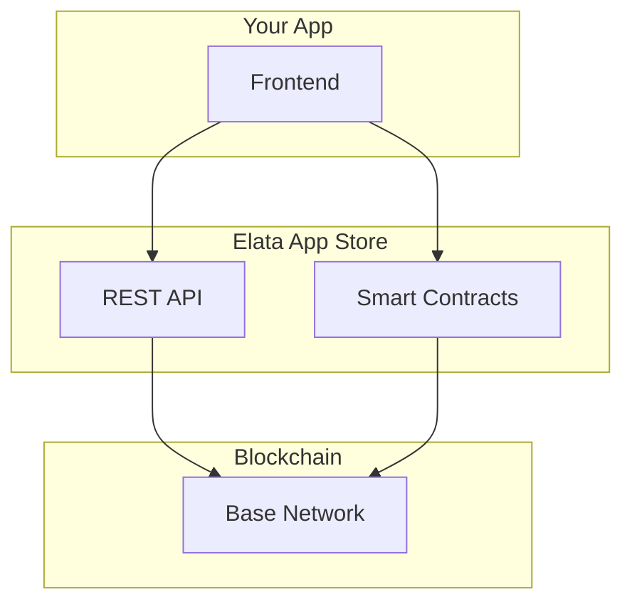

## Overview

Three ways to integrate: embed in the App Store iframe, hit the REST API, or talk to contracts directly. For full code, see [GitHub](https://github.com/elata-biosciences).

---

## Architecture



### Integration Options

| Method | Use Case | Complexity |
|--------|----------|------------|
| **App Store Embed** | Run app in Elata iframe | Low |
| **REST API** | Read app data, metadata | Medium |
| **Smart Contracts** | Direct blockchain interaction | High |

---

## App Store API

The App Store provides REST endpoints for reading data.

### Base URL

```
https://app.elata.bio/api
```

### Endpoints

#### Get All Apps

```bash
GET /api/apps
```

Returns list of all apps with metadata:

```json
{
  "apps": [
    {
      "id": "...",
      "tokenAddress": "0x...",
      "name": "NeuroPong",
      "symbol": "NPONG",
      "description": "...",
      "imageUrl": "...",
      "creator": "0x...",
      "status": "raising" | "live",
      "createdAt": "2024-01-01T00:00:00Z"
    }
  ]
}
```

#### Get Single App

```bash
GET /api/apps/{tokenAddress}
```

Returns detailed app information including:
- Basic metadata
- Social links
- Team members
- Artifacts (game files)

#### Get Prices

```bash
GET /api/prices
```

Returns current ELTA price data for UI display.

---

## Smart Contracts

For direct blockchain interaction, these are the key contracts:

### Core Contracts

| Contract | Purpose |
|----------|---------|
| **ELTA** | Main protocol token |
| **VeELTA** | Vote-escrowed staking |
| **AppFactory** | Creates new apps |
| **AppFactoryViews** | Read app data |

### Per-App Contracts

| Contract | Purpose |
|----------|---------|
| **AppToken** | Individual app token |
| **AppBondingCurve** | Price discovery |
| **AppStakingVault** | Staking for rewards |
| **AppAccess1155** | NFT items |
| **Tournament** | Competition infrastructure |

### Contract Addresses

See [Resources → Contracts](/resources/smart-contracts) for deployed addresses.

---

## Reading On-Chain Data

### Using wagmi/viem (Recommended)

```typescript
import { createPublicClient, http } from 'viem'
import { baseSepolia } from 'viem/chains' // Use 'base' for mainnet

const client = createPublicClient({
  chain: baseSepolia,
  transport: http()
})

// Read app data from factory
const appData = await client.readContract({
  address: APP_FACTORY_ADDRESS,
  abi: AppFactoryABI,
  functionName: 'apps',
  args: [appId]
})
```

### Key Read Functions

| Contract | Function | Returns |
|----------|----------|---------|
| AppFactory | `apps(uint256)` | App tuple (creator, token, vault, curve, etc.) |
| AppFactory | `appCount()` | Total apps launched |
| AppToken | `balanceOf(address)` | User token balance |
| AppStakingVault | `balanceOf(address)` | User staked balance |
| AppBondingCurve | `getPrice()` | Current curve price |
| VeELTA | `balanceOf(address)` | User veELTA balance |

---

## Writing Transactions

### App Launch

```typescript
import { writeContract } from 'wagmi'

// Approve ELTA first
await writeContract({
  address: ELTA_ADDRESS,
  abi: ERC20ABI,
  functionName: 'approve',
  args: [APP_FACTORY_ADDRESS, 110n * 10n**18n]
})

// Create app
await writeContract({
  address: APP_FACTORY_ADDRESS,
  abi: AppFactoryABI,
  functionName: 'createApp',
  args: [name, symbol, 0n, description, imageUrl, website]
})
```

### Buy on Bonding Curve

```typescript
// Approve ELTA for curve
await writeContract({
  address: ELTA_ADDRESS,
  abi: ERC20ABI,
  functionName: 'approve',
  args: [CURVE_ADDRESS, amount]
})

// Buy tokens
await writeContract({
  address: CURVE_ADDRESS,
  abi: AppBondingCurveABI,
  functionName: 'buy',
  args: [eltaAmount, minTokensOut]
})
```

### Stake Tokens

```typescript
// Approve tokens for vault
await writeContract({
  address: APP_TOKEN_ADDRESS,
  abi: ERC20ABI,
  functionName: 'approve',
  args: [VAULT_ADDRESS, amount]
})

// Stake
await writeContract({
  address: VAULT_ADDRESS,
  abi: AppStakingVaultABI,
  functionName: 'stake',
  args: [amount]
})
```

---

## Embedding in Iframe

Apps run inside an iframe on the Elata App Store. Your app can:

### Communicate with Parent

```javascript
// Send message to Elata frame
window.parent.postMessage({
  type: 'ELATA_EVENT',
  payload: { action: 'SCORE_UPDATE', score: 1000 }
}, '*')

// Listen for messages from Elata
window.addEventListener('message', (event) => {
  if (event.data.type === 'ELATA_USER') {
    const { address, balance } = event.data.payload
    // Use user data
  }
})
```

### Access User Data

When embedded, your app receives:
- Connected wallet address
- App token balance
- Staked amount
- Owned items

---

## Webhooks (Coming Soon)

Future webhook support for:
- New token purchases
- Staking events
- Tournament entries
- Item purchases

---

## SDKs & Libraries

### Official Packages

| Package | Purpose | Status |
|---------|---------|--------|
| `@elata/sdk` | TypeScript SDK | Planned |
| `@elata/react` | React hooks | Planned |

### Current Approach

Use the App Store source as reference:
- [elata-appstore](https://github.com/elata-biosciences/elata-appstore) - Frontend code
- [elata-protocol](https://github.com/elata-biosciences/elata-protocol) - Smart contracts

### Useful Hooks from App Store

The App Store includes React hooks you can reference:

```typescript
// Examples from elata-appstore/src/hooks/

useAppFactory()      // App creation and data
useBondingCurve()    // Price quotes, buy/sell
useAppHoldings()     // User balances
useVeELTA()          // veELTA staking
useTournament()      // Tournament interactions
```

---

## ABIs

Contract ABIs are available in the App Store repository:

```
elata-appstore/src/abi/
├── AppFactory.json
├── AppBondingCurve.json
├── AppToken.json
├── AppStakingVault.json
├── AppAccess1155.json
├── Tournament.json
├── ELTA.json
├── VeELTA.json
└── ...
```

---

## Rate Limits

### API Limits

| Endpoint | Limit |
|----------|-------|
| Read endpoints | 100 req/min |
| Heavy queries | 10 req/min |

### RPC Limits

Use your own RPC provider for production:
- [Alchemy](https://alchemy.com)
- [Infura](https://infura.io)
- [QuickNode](https://quicknode.com)

---

## Example: Price Display Widget

```typescript
import { useReadContract } from 'wagmi'
import { formatEther } from 'viem'

function PriceWidget({ curveAddress }) {
  const { data: price } = useReadContract({
    address: curveAddress,
    abi: AppBondingCurveABI,
    functionName: 'getPrice',
  })
  
  return (
    <div>
      Current Price: {price ? formatEther(price) : '...'} ELTA
    </div>
  )
}
```

---

## Resources

<CardGroup cols={2}>
  <Card title="App Store Repo" icon="github" href="https://github.com/elata-biosciences/elata-appstore">
    Frontend implementation reference
  </Card>
  <Card title="Protocol Repo" icon="github" href="https://github.com/elata-biosciences/elata-protocol">
    Smart contract source code
  </Card>
  <Card title="Contract Addresses" icon="file-contract" href="/resources/smart-contracts">
    Deployed contract addresses
  </Card>
  <Card title="Discord" icon="discord" href="https://discord.gg/GqS9CstffK">
    Developer support channel
  </Card>
</CardGroup>


