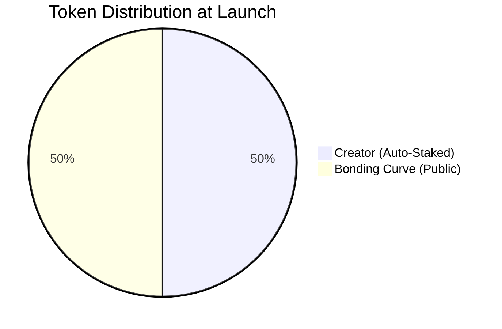

## Overview

Every app token trades on a bonding curve until graduation. Price is set by math — buy = price goes up, sell = price goes down. Early buyers get better prices.

---

## How Bonding Curves Work

A bonding curve is a mathematical formula that determines token price based on supply:

```
Price = f(Supply Sold)
```

As more tokens are purchased:
- Price increases according to the curve
- Early buyers get lower prices
- Later buyers pay higher prices
- Sellers receive the current curve price


---

## Key Parameters

| Parameter | Value | Description |
|-----------|-------|-------------|
| **Launch Cost** | 110 ELTA | 100 seed + 10 fee |
| **Token Supply** | 1 billion | Total app token supply |
| **Creator Share** | 50% | Auto-staked at launch |
| **Curve Share** | 50% | Available for purchase |
| **Trading Fee** | 1% | Applied to all trades |
| **Graduation Target** | 42,000 ELTA | Triggers DEX listing |

---

## Token Distribution

At launch, the 1 billion tokens are split:



### Creator Allocation (50%)

- **500 million tokens** minted to creator
- **Automatically staked** in the staking vault
- Earns trading fees immediately
- Can be unstaked anytime (visible on-chain)

### Bonding Curve (50%)

- **500 million tokens** available for public purchase
- Price starts low, increases with demand
- Sold tokens remain in circulation
- Unsold tokens stay on curve until graduation

---

## Price Mechanics

### Buying Tokens

When you buy app tokens:

1. You pay ELTA to the bonding curve
2. Price is calculated based on current supply sold
3. **1% trading fee** is deducted
4. You receive app tokens at the curve price

**Example Buy:**
```
Want: 1,000,000 APP tokens
Curve Price: 0.00005 ELTA per token
Subtotal: 50 ELTA
Trading Fee (1%): 0.5 ELTA
Total Cost: 50.5 ELTA
```

### Selling Tokens

When you sell app tokens:

1. You send app tokens back to the curve
2. Current curve price determines ELTA received
3. **1% trading fee** is deducted
4. You receive ELTA

**Example Sell:**
```
Selling: 1,000,000 APP tokens
Curve Price: 0.00008 ELTA per token
Gross: 80 ELTA
Trading Fee (1%): 0.8 ELTA
You Receive: 79.2 ELTA
```

### Price Impact

Large orders affect the price:
- Big buys push price higher during execution
- Big sells push price lower during execution
- The curve ensures continuous liquidity

---

## Fee Distribution

The 1% trading fee is distributed automatically:

| Recipient | Share | Purpose |
|-----------|-------|---------|
| App Stakers | 70% | Rewards for staking |
| veELTA Holders | 15% | Protocol governance rewards |
| Treasury | 15% | Protocol development |

**Example**: On a trade with 1 ELTA fee:
- 0.70 ELTA → App token stakers
- 0.15 ELTA → veELTA holders
- 0.15 ELTA → Treasury

---

## Graduation

When the bonding curve accumulates **42,000 ELTA**, graduation triggers automatically:

### What Happens

1. **Liquidity Deployment**: ELTA + remaining tokens create a DEX pair
2. **LP Locking**: Liquidity tokens locked for **2 years**
3. **Free Trading**: Token now trades on decentralized exchanges
4. **Bonding Curve Closes**: No more curve trades

### Why 42,000 ELTA?

This target ensures:
- Sufficient liquidity for healthy trading
- Meaningful price discovery phase
- Protection against low-liquidity manipulation

### Post-Graduation

After graduation:
- Trade on DEX (Uniswap, etc.)
- Transfer fees (1%) still apply
- Staking rewards continue
- LP is locked (rug-pull protection)

---

## XP-Gated Early Access

New app launches include a **6-hour early access period**:

| Time | Who Can Buy |
|------|-------------|
| 0-6 hours | XP holders only (≥100 XP) |
| After 6 hours | Everyone |

### Why Early Access?

- **Rewards participation**: XP is earned through protocol engagement
- **Prevents sniping**: Bots can't front-run without XP
- **Fair distribution**: Real users get first access

---

## Price Growth Example


As tokens are purchased:

| Tokens Sold | Price (ELTA) | Market Cap |
|-------------|--------------|------------|
| 10M | 0.00001 | 10K ELTA |
| 50M | 0.00003 | 150K ELTA |
| 100M | 0.00005 | 500K ELTA |
| 200M | 0.0001 | 2M ELTA |
| 500M | Graduation | DEX Trading |

*Note: Actual curve parameters may vary*

---

## LP Locking

At graduation, liquidity pool tokens are **locked for 2 years**:

### What This Means

- Creator **cannot** remove liquidity
- Liquidity stays in the pool
- Protects against "rug pulls"
- Ensures long-term trading availability

### Viewing Lock Info

On your app's detail page:
- Lock address shown in Contract Addresses
- Unlock date displayed
- Verifiable on Basescan

---

## Builder Economics

### Your Revenue Sources

As an app creator:

1. **Staking Rewards**: 50% stake earns proportional fees
2. **Token Appreciation**: If demand grows, your tokens gain value
3. **Items/Tournaments**: Additional revenue streams

### Example Scenario

```
Launch: 110 ELTA
Your stake: 50% of supply

Month 1 trading volume: 5,000 ELTA
Trading fees: 50 ELTA
Your share (as ~50% of stakers): ~17.5 ELTA

If app graduates and token 2x:
Your 500M tokens worth significantly more
```

---

## Advice

- **Most apps don't graduate** — focus on building something people want
- **Talk to your holders** — updates and engagement drive demand
- **Keep your stake** — unstaking is visible on-chain, signals you're leaving
- **Plan for graduation** — know what you'll do once you're on DEX

---

## Key Formulas

### Trading Fee

$$
F_{\text{protocol}} = P \times 0.01
$$

Where $P$ is the purchase/sale amount.

### Graduation Trigger

$$
\text{Graduate when } \sum \text{ELTA in curve} \geq 42{,}000
$$

### LP Lock Period

$$
\text{Unlock Date} = \text{Graduation Date} + 730 \text{ days}
$$

---

## Next Steps

<CardGroup cols={2}>
  <Card title="Launch Your App" icon="rocket" href="/builders/launch-your-app">
    Ready to launch? Follow the guide
  </Card>
  <Card title="Grow Community" icon="users" href="/builders/grow-your-community">
    Tournaments, items, and engagement
  </Card>
</CardGroup>


