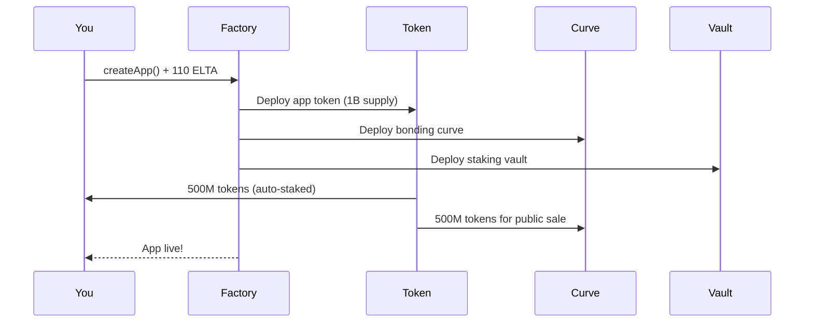

## What You Get

Pay 110 ELTA, launch an app, get a token. That's it.

Your app ships with:
- **1 billion tokens** — 50% yours (auto-staked), 50% for sale
- **Bonding curve** — price goes up as people buy
- **Staking vault** — users stake, everyone earns fees
- **Tournaments & items** — add them later if you want

No Solidity. No audits. No fundraising. Just build your app and deploy.

<Warning>
  **Testnet**: Currently on Base Sepolia. Mainnet coming soon. Perfect time to test your launch.
</Warning>

<CardGroup cols={2}>
  <Card title="Launch Guide" icon="rocket" href="/builders/launch-your-app">
    5-minute walkthrough
  </Card>
  <Card title="Token Economics" icon="chart-line" href="/builders/bonding-curve-economics">
    How pricing works
  </Card>
</CardGroup>

---

## How You Make Money

| Source | How |
|--------|-----|
| **Your 50%** | Auto-staked at launch. Earns fees immediately. |
| **Trading fees** | 70% of 1% fee on every trade goes to stakers. You're the biggest staker. |
| **Items** | Sell NFTs that unlock features. Payments get burned (shrinks supply). |
| **Tournaments** | Entry fees pool into prizes. You set the rules. |

---

## Distribution

Your app goes live on the [App Store](https://app.elata.bio) instantly. XP holders get 6 hours early access before public launch.

---

## What Can You Build?

Anything that runs in a browser. Focus on neurotech but the protocol doesn't enforce it.

| Type | Examples |
|------|----------|
| **Focus tools** | Pomodoro with EEG, attention trainers |
| **Games** | Brain-controlled gameplay, neurofeedback challenges |
| **Wellness** | Meditation apps, stress tracking |
| **Research** | Data collection, cognitive tests |

---

## Requirements

| Need | Details |
|------|---------|
| **110 ELTA** | 100 seeds your curve, 10 is protocol fee |
| **Wallet** | MetaMask, Coinbase Wallet, etc. |
| **App files** | HTML/JS/CSS that runs in an iframe |
| **Metadata** | Name, symbol, description, image |

<Note>
  **Testnet**: DM [@elata_bio](https://x.com/elata_bio) your wallet address for free testnet ELTA.
</Note>

---

## Quick Start

**1. Build your app**

Any web app works — React, Vue, vanilla JS. Just needs an `index.html` at root.

**2. Get ELTA**

Need 110 ELTA. On testnet, DM us. On mainnet, buy on Uniswap.

**3. Launch**

Go to [app.elata.bio/launch](https://app.elata.bio/launch):
1. Connect wallet
2. Enter name, symbol, description
3. Upload image
4. Approve + confirm

**4. Upload your app**

On your new app page, drag your folder into "Upload / Replace Game."

Done. App is live.

---

## Under the Hood

When you hit "Launch":

The factory deploys three contracts:
- **Token** — your app's ERC-20
- **Curve** — handles buy/sell pricing
- **Vault** — staking for fee distribution

Your 500M tokens are staked immediately. You're earning from trade one.

---

## After Launch

**Immediately:**
- Upload your game files
- Share the link
- Add social links and team members in settings

**Later:**
- Add items (NFTs) and tournaments
- Run competitions
- Iterate based on feedback

**Your stake:**

Your 50% is auto-staked. You earn from every trade. You can unstake anytime, but it's visible on-chain — keeping it staked signals commitment to buyers.

---

## More

<CardGroup cols={2}>
  <Card title="Launch Guide" icon="play" href="/builders/launch-your-app">
    Full walkthrough
  </Card>
  <Card title="Bonding Curves" icon="chart-line" href="/builders/bonding-curve-economics">
    Pricing and graduation
  </Card>
  <Card title="Growth Tools" icon="users" href="/builders/grow-your-community">
    Tournaments and items
  </Card>
  <Card title="API" icon="code" href="/builders/api-overview">
    Integration points
  </Card>
</CardGroup>

---

## Help

- **Discord**: [#builders channel](https://discord.gg/GqS9CstffK)
- **GitHub**: [Source code](https://github.com/elata-biosciences)
- **Twitter**: [@elata_bio](https://x.com/elata_bio)

