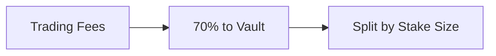

## Overview

Once your app is live, you have three levers: staking (passive income for holders), tournaments (competitions with prizes), and items (NFTs that unlock features). Here's how to use them.

---

## Staking

Your app ships with a staking vault. Users deposit tokens, earn 70% of trading fees.



**Why it matters**: Stakers don't sell. More staking = less sell pressure = healthier token.

---

## App Modules

After launch, you can deploy additional modules from the Creator Console.

### Deploying Modules

1. Go to your app's detail page
2. Scroll to "Creator Console"
3. Click "Deploy Modules"
4. Confirm the transaction

This deploys:

- **AppAccess1155**: NFT items and passes
- **EpochRewards**: Seasonal reward distributions

---

## Items (NFTs)

Create and sell NFT items that provide utility within your app.

### Creating Items

In the Creator Console → Items Manager:

1. Click "Add Item"
2. Set item details:
   - **Name**: Item display name
   - **Price**: Cost in app tokens
   - **Soulbound**: Whether transferable
   - **Max Supply**: Total available (0 = unlimited)
   - **Time Window**: Optional sale period

### Item Types

| Type            | Use Case              | Example             |
| --------------- | --------------------- | ------------------- |
| **Access Pass** | Gate premium features | Pro Membership      |
| **Cosmetic**    | Visual customization  | Gold Avatar Frame   |
| **Power-up**    | In-game advantage     | 2x Score Multiplier |
| **Collectible** | Limited edition items | "Genesis Badge"     |

### Burn Mechanics

**100% of item purchases are burned**:

```
User pays 100 APP tokens → 100 APP tokens burned → Item minted
```

This creates deflationary pressure on your token supply.

### Feature Gating

Use items to gate app features:

```javascript
// In your app, check if user owns item
const hasAccess = await checkFeatureAccess(userAddress, featureId, userStake);

if (hasAccess) {
  // Show premium feature
} else {
  // Show upgrade prompt
}
```

### Soulbound vs Transferable

| Soulbound                           | Transferable                      |
| ----------------------------------- | --------------------------------- |
| Cannot be sold/transferred          | Can trade on marketplaces         |
| Tied to original buyer              | Enables secondary market          |
| Best for: memberships, achievements | Best for: collectibles, cosmetics |

---

## Tournaments

Run competitions with entry fees and prize pools.

### Creating a Tournament

In Creator Console → Tournaments:

1. Click "Create Tournament"
2. Configure:
   - **Name**: Tournament title
   - **Entry Fee**: Cost to participate (in app tokens)
   - **Start Time**: When entries open
   - **End Time**: When entries close
   - **Description**: Rules and details

### Tournament Economics

Entry fees are split at finalization:

| Recipient | Share | Example (1000 token pool) |
| --------- | ----- | ------------------------- |
| Winners   | 96.5% | 965 tokens                |
| Protocol  | 2.5%  | 25 tokens                 |
| Burned    | 1 %   | 10 tokens                 |

### Running the Tournament

1. **Entry Phase**: Users pay entry fee to join
2. **Competition Phase**: Run your game/challenge
3. **Finalization**: Submit winner rankings
4. **Distribution**: Winners claim prizes via Merkle proofs

### Prize Distribution

You decide how to split the prize pool:

- Winner takes all
- Top 3 split
- Tiered payouts
- Participation rewards

Generate a Merkle tree with allocations, then finalize the tournament.

---

## Playbook

### Launch Week

1. **Hype early access** — XP holders get 6 hours head start
2. **Run a tournament** — generates trading volume
3. **Drop a genesis item** — rewards early supporters
4. **Do an AMA** — Discord or Twitter Space

### After Launch

- **Weekly tournaments** — keeps people coming back
- **Limited items** — creates urgency
- **Leaderboards** — competition drives retention
- **Let holders vote** — on features, formats, whatever

---

## Holder Distribution

Monitor who holds your token on your app's detail page:

- **Top 10 holders**: Visible with percentages
- **Staked vs liquid**: See engagement levels
- **Distribution chart**: Visualize concentration

### Healthy Distribution

| Metric               | Target  | Why                   |
| -------------------- | ------- | --------------------- |
| Top 10 concentration | \< 50%  | Prevents manipulation |
| Staked percentage    | \>30%   | Shows commitment      |
| Unique holders       | Growing | Wider community       |

---

## Social Links

Add official channels to your app page:

1. Go to app detail page
2. Click "Edit App"
3. Add links:
   - Twitter/X
   - Discord
   - Telegram
   - GitHub
   - Website

This helps users find your community and reduces scam risks.

---

## Team Members

List team wallet addresses for transparency:

1. In Edit App modal
2. Add team member addresses
3. Optionally add ENS names

Users can see:

- Team wallet addresses
- Link to Basescan profiles
- Build trust through transparency

---

## Analytics to Track

| Metric                 | What It Tells You      |
| ---------------------- | ---------------------- |
| **Trading Volume**     | Interest and liquidity |
| **Unique Holders**     | Community size         |
| **Staking Rate**       | Long-term commitment   |
| **Tournament Entries** | Engagement depth       |
| **Item Sales**         | Premium feature demand |

---

## What Works

- **Talk to your holders** — weekly updates, respond to feedback
- **Reward loyalty** — exclusive items for long-term holders
- **Don't dump everything at once** — space out tournaments and drops
- **Actually listen** — they're invested, their input matters

---

## Next Steps

<CardGroup cols={2}>
  <Card title="API Overview" icon="code" iconType="light" href="/builders/api-overview">
    Integrate with Elata programmatically
  </Card>
  <Card title="Bonding Curves" icon="chart-line" iconType="light" href="/builders/bonding-curve-economics">
    Understand pricing mechanics
  </Card>
</CardGroup>