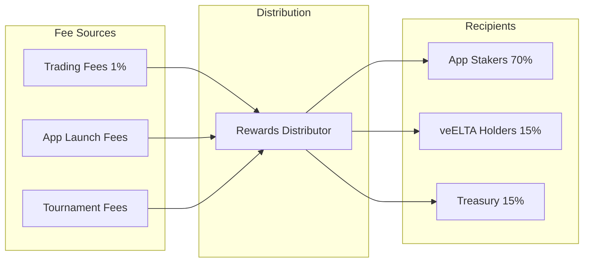

## Architecture

Three layers, each doing one thing well.

---

## Layer 1: Apps

Where users actually do stuff.

- **App Store** — browse and launch apps
- **App Tokens** — each app has its own ERC-20 token (1B supply)
- **Features** — tournaments with prize pools, NFT items that unlock things

### Layer 2: Economics

Where money moves.

| Piece | Job |
|-------|-----|
| **Bonding Curves** | Set token prices based on supply sold |
| **Staking Vaults** | Deposit tokens, earn fees |
| **Fee Router** | Collect fees from all sources |
| **Rewards Distributor** | Split fees 70/15/15 |

### Layer 3: Governance

Where decisions happen.

- **veELTA** — lock ELTA for voting power (longer lock = bigger boost)
- **Governor** — on-chain proposals and voting
- **LotPool** — XP-weighted funding for new projects
- **Timelock** — 48-hour delay before execution

---

## Where Fees Come From

Three sources:

1. **Trading (1%)** — every buy/sell on a bonding curve
2. **Launches (10 ELTA)** — flat fee per new app
3. **Tournaments (2.5%)** — cut of prize pools

### Where Fees Go

| Who | Cut | Why |
|-----|-----|-----|
| **App stakers** | 70% | Reward people holding and staking app tokens |
| **veELTA holders** | 15% | Reward long-term ELTA lockers |
| **Treasury** | 15% | Fund development, grants, ops |

---

## App Lifecycle

### Launch

Developer pays **110 ELTA**:
- 100 ELTA → seeds the bonding curve
- 10 ELTA → treasury

Gets:
- 1 billion tokens total
- 50% auto-staked (earning fees immediately)
- 50% on the bonding curve for sale

### Raising

- Users buy from the curve
- Price rises with each purchase
- 1% fee on every trade
- XP holders get 6-hour head start

### Graduation

Curve hits **42,000 ELTA** collected:
- Liquidity auto-deploys to Uniswap
- LP tokens locked 2 years (no rug pulls)
- Free market trading begins

### Live

Post-graduation:
- Trades on DEX
- Staking rewards keep flowing
- Creator can add tournaments, items
- Token holders can organize around the app

---

## Who Does What

| Role | Does | Earns |
|------|------|-------|
| **Builders** | Launch apps | 50% of tokens (auto-staked) + fees |
| **Token holders** | Buy/stake app tokens | 70% of trading fees |
| **ELTA lockers** | Lock ELTA as veELTA | 15% of all protocol fees + votes |
| **Users** | Play apps, enter tournaments | XP, early access, prizes |

---

## Security

| Protection | How |
|------------|-----|
| **LP locking** | Liquidity locked 2 years at graduation. Can't rug. |
| **Immutable contracts** | No admin keys. Rules can't change post-deploy. |
| **Timelock** | 48-hour delay on governance actions. |
| **XP early access** | 6-hour window for XP holders before public launch. Stops bots. |

---

## Next

<CardGroup cols={2}>
  <Card title="Tokenomics" icon="chart-pie" href="/learn/tokenomics">
    ELTA supply, distribution, veELTA math
  </Card>
  <Card title="Revenue Model" icon="money-bill" href="/learn/revenue-model">
    Fee mechanics and yield calculations
  </Card>
</CardGroup>

