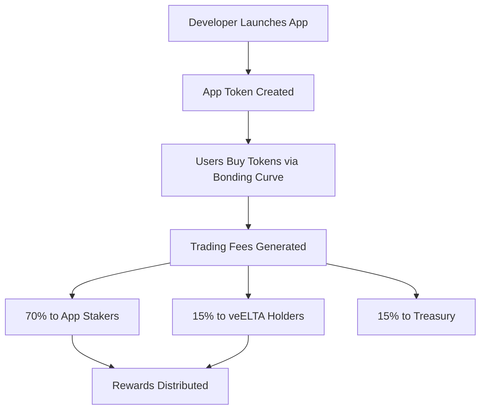

## Overview

Elata lets you launch neurotech apps with their own tokens — no fundraising, no gatekeepers. You bring the app, we handle the token economics.

<Info>
  **Network**: Live on **Base Sepolia** (testnet). Mainnet on **Base** coming soon.
</Info>

<CardGroup cols={2}>
  <Card title="For Builders" icon="hammer" href="/builders/getting-started">
    Launch your app with a native token in minutes
  </Card>
  <Card title="For Users" icon="user" href="/users/explore-apps">
    Find apps, stake tokens, earn fees
  </Card>
</CardGroup>

---

## Why This Exists

Building neurotech is hard. Getting paid for it is harder. Most developers either join a closed platform that takes ownership of their work, or spend months chasing grants and investors instead of building.

Elata flips this: launch an app, get a token, start earning from day one. Users who believe in your app can buy in early and share in its success.

---

## What Elata Does

The short version: permissionless app launches with built-in token economics.

### If You're Building

- **Pay 110 ELTA**, get a token with 1 billion supply
- **Keep 50%** of your token, auto-staked and earning fees
- **Sell the other 50%** through a bonding curve — price goes up as people buy
- **Add features** like tournaments, NFT items, staking rewards

No smart contract development needed. The infrastructure deploys automatically.

### If You're Using or Investing

- **Browse apps** on the App Store
- **Buy tokens early** through bonding curves (lower price = earlier)
- **Stake tokens** to earn 70% of trading fees
- **Lock ELTA as veELTA** for governance votes and 15% of all protocol fees

---

## The Flow

1. **Launch**: Pay 110 ELTA → get 1B tokens (50% yours, 50% for sale)
2. **Trade**: Bonding curve sets price based on demand. 1% fee on every trade.
3. **Earn**: Fees split 70/15/15 — stakers, veELTA holders, treasury
4. **Graduate**: Hit 42,000 ELTA raised → liquidity moves to Uniswap, LP locked for 2 years

---

## Key Pieces

| Component | What It Does |
|-----------|---------|
| **ELTA** | Protocol token. Used to launch apps and trade. |
| **veELTA** | Locked ELTA. Gets you votes + 15% of fees. |
| **App Tokens** | Each app's own token. 1B supply per app. |
| **Bonding Curves** | Sets price based on demand until graduation. |
| **Staking Vaults** | Stake app tokens → earn 70% of that app's fees. |

---

## Next

<CardGroup cols={3}>
  <Card title="Tokenomics" icon="chart-line" href="/learn/tokenomics">
    ELTA supply and mechanics
  </Card>
  <Card title="Launch an App" icon="rocket" href="/builders/launch-your-app">
    5-minute deployment guide
  </Card>
  <Card title="Explore Apps" icon="compass" href="/users/explore-apps">
    See what's live
  </Card>
</CardGroup>

---

## Links

- [App Store](https://app.elata.bio) — Browse and interact with apps
- [GitHub](https://github.com/elata-biosciences) — View the source code
- [Discord](https://discord.gg/GqS9CstffK) — Join the community
- [Twitter/X](https://x.com/elata_bio) — Follow for updates

