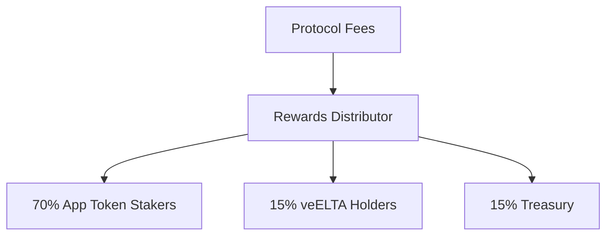
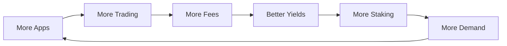

## Overview

Protocol fees come from trading, launches, and tournaments. They get split 70/15/15 and distributed to stakers, veELTA holders, and treasury. No token inflation — rewards come from actual usage.

<Info>
  Fee parameters can be changed through governance.
</Info>

---

## Fee Sources

### 1. Trading Fees (Primary Revenue)

A **1% fee** is charged on all bonding curve transactions:

| Transaction Type | Fee | When Applied |
|-----------------|-----|--------------|
| Buy on Bonding Curve | 1% | Before graduation |
| Sell on Bonding Curve | 1% | Before graduation |

**Example**: Buying 1,000 ELTA worth of app tokens costs 1,010 ELTA total (1,000 + 10 fee).

### 2. App Launch Fees

When developers launch new apps, they pay **110 ELTA**:

| Component | Amount | Destination |
|-----------|--------|-------------|
| Seed Liquidity | 100 ELTA | Bonding Curve |
| Protocol Fee | 10 ELTA | Treasury → Rewards |

### 3. App Token Transfer Fees

App tokens include a **1% transfer fee** (configurable, max 2%):

| Parameter | Default | Maximum |
|-----------|---------|---------|
| Transfer Fee | 1% | 2% |

This creates ongoing yield even after graduation to DEX trading.

### 4. Tournament Fees

Tournaments collect fees from prize pools:

| Fee Type | Rate | Destination |
|----------|------|-------------|
| Protocol Fee | 2.5% | Rewards Distributor |
| Burn Fee | 1% | Burned (deflationary) |

---

## The 70/15/15 Split

All protocol revenue is automatically split:



### Recipient Details

<AccordionGroup>
  <Accordion title="App Token Stakers (70%)">
    The majority of fees go to users who stake app tokens in staking vaults. Rewards are distributed proportionally based on stake size.
    
    **How to earn**: Stake any app token in its staking vault. The longer and more you stake, the larger your share of rewards.
  </Accordion>
  <Accordion title="veELTA Holders (15%)">
    A portion of all protocol fees flows to users who have locked ELTA as veELTA. This rewards long-term protocol supporters.
    
    **How to earn**: Lock ELTA for 7 days to 2 years. Longer locks receive boosted voting power (1x-2x).
  </Accordion>
  <Accordion title="Treasury (15%)">
    Treasury funds support ongoing development, grants, and ecosystem growth initiatives. Treasury spending is governed by veELTA holders.
    
    **What it funds**: Developer grants, security audits, marketing, partnerships, and infrastructure.
  </Accordion>
</AccordionGroup>

---

## Revenue Flow Example

Let's trace a $1,000 ELTA trade through the system:

### Step 1: Trade Execution

A user buys app tokens worth **1,000 ELTA** on the bonding curve.

| Amount | Destination |
|--------|-------------|
| 990 ELTA | App Token Purchase |
| 10 ELTA | Trading Fee (1%) |

### Step 2: Fee Distribution

The 10 ELTA trading fee is split:

| Recipient | Share | Amount |
|-----------|-------|--------|
| App Stakers | 70% | 7 ELTA |
| veELTA Holders | 15% | 1.5 ELTA |
| Treasury | 15% | 1.5 ELTA |

### Step 3: Staker Rewards

The 7 ELTA for app stakers is distributed proportionally:

```
Your Share = (Your Stake / Total Staked) × 7 ELTA
```

If you've staked 1% of the total vault, you earn 0.07 ELTA from this trade.

---

## Yield Calculations

### App Staker Yield

Your yield as an app staker depends on:
- **Your stake size** relative to total staked
- **Trading volume** of the app token
- **Transfer volume** after graduation

**Formula:**

$$
\text{Annual Yield} = \frac{\text{Your Stake}}{\text{Total Staked}} \times \text{Annual Fees} \times 0.70
$$

### veELTA Yield

Your yield as a veELTA holder depends on:
- **Your veELTA balance** relative to total veELTA
- **Total protocol revenue** across all apps

**Formula:**

$$
\text{Annual Yield} = \frac{\text{Your veELTA}}{\text{Total veELTA}} \times \text{Annual Protocol Fees} \times 0.15
$$

---

## Claiming Rewards

### For App Stakers

Rewards accumulate in the Rewards Distributor and can be claimed at any time:

1. Go to the app's detail page
2. Navigate to the "Rewards" section
3. Click "Claim" to receive your ELTA

### For veELTA Holders

veELTA rewards are distributed in epochs:

1. Go to the [Rewards page](https://app.elata.bio/rewards)
2. View your claimable rewards
3. Click "Claim veELTA Rewards"

<Note>
  There's no deadline to claim rewards. Unclaimed rewards remain available indefinitely.
</Note>

---

## Deflationary Mechanics

Beyond fee distribution, Elata includes deflationary mechanisms:

### Item Purchase Burns

When users buy items in apps, **100% of the payment is burned**:

```
User pays 100 APP tokens → 100 APP tokens burned → Item minted
```

### Tournament Burns

Tournament prize pools include a **1% burn fee**:

| Pool Size | Burn Amount | Winners Receive |
|-----------|-------------|-----------------|
| 10,000 tokens | 100 burned | 9,650 (after fees) |

### App Token Supply Reduction

Over time, burns from items and tournaments reduce app token supply, benefiting remaining holders.

---

## Growth Loop

More apps → more trading → more fees → better yields → more staking → more demand → more apps.



Simple: usage drives rewards, rewards drive usage.

---

## vs. Inflationary Models

| | Elata | Most DeFi |
|-|-------|-----------|
| **Where yield comes from** | Fees from usage | Printing new tokens |
| **What happens over time** | More usage = more yield | Dilution eats returns |
| **Who wins** | Long-term holders | Early farmers |

---

## Key Numbers

| Metric | Value |
|--------|-------|
| Trading Fee | 1% |
| App Launch Fee | 10 ELTA |
| Tournament Protocol Fee | 2.5% |
| Transfer Fee (App Tokens) | 1% (default) |
| App Staker Share | 70% |
| veELTA Share | 15% |
| Treasury Share | 15% |

---

## Next Steps

<CardGroup cols={2}>
  <Card title="Stake App Tokens" icon="coins" href="/users/stake-and-earn">
    Start earning 70% of trading fees
  </Card>
  <Card title="Lock ELTA" icon="lock" href="/users/veelta-governance">
    Earn 15% of all protocol fees
  </Card>
</CardGroup>


