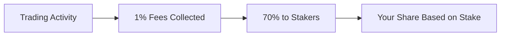

## Overview

Stake app tokens → earn 70% of trading fees. Your share is proportional to how much you've staked vs. total staked.

<Info>
  Every app has its own staking vault. Stake in as many as you want
</Info>

---

## How Staking Works

1. **Trading fees** (1%) are collected on all transactions
2. **70%** of fees flow to the app's staking vault
3. **Rewards distributed** proportionally by stake size
4. **Claim anytime** — no lock-up period

---

## Your Earnings

### Calculation

Your share of rewards:

$$
\text{Your Rewards} = \frac{\text{Your Stake}}{\text{Total Staked}} \times \text{Total Fees} \times 0.70
$$

### Example

| Metric                 | Value              |
| ---------------------- | ------------------ |
| Your stake             | 10,000,000 tokens  |
| Total staked           | 100,000,000 tokens |
| Monthly trading volume | 50,000 ELTA        |
| Monthly fees (1%)      | 500 ELTA           |
| Staker share (70%)     | 350 ELTA           |
| Your share (10%)       | 35 ELTA/month      |

---

## Staking Step-by-Step

### Step 1: Hold App Tokens

First, you need app tokens to stake:

- Buy on bonding curve (if raising)
- Trade on DEX (if live)
- Receive from others

### Step 2: Go to App Page

Navigate to the app whose tokens you want to stake.

### Step 3: Find Staking Section

Scroll to the "Stake" section on the app detail page.

### Step 4: Enter Amount

<Steps>
  <Step title="Enter Stake Amount">
    Type how many tokens you want to stake
  </Step>
  <Step title="Approve Tokens">
    First time: approve the vault to use your tokens
  </Step>
  <Step title="Confirm Stake">
    Execute the staking transaction
  </Step>
</Steps>

### Step 5: Start Earning

Your tokens are now staked and earning rewards!

---

## Claiming Rewards

Rewards accumulate and can be claimed anytime.

### How to Claim

1. Go to the app's detail page
2. Find the "Rewards" section
3. See your claimable balance
4. Click "Claim"
5. Confirm the transaction

<Note>
  Rewards are paid in \$ELTA, the primary token of the Elata Ecosystem, not individual app tokens
</Note>

### Claim Frequency

- No minimum claim amount
- Claim whenever you want
- Unclaimed rewards don't expire
- Consider gas costs for small claims

---

## Unstaking

You can unstake anytime with no lock-up period.

### How to Unstake

1. Go to app's staking section
2. Click "Unstake" tab
3. Enter amount to withdraw
4. Confirm transaction
5. Tokens returned to your wallet

### Considerations

- **No penalty** for unstaking
- **Stop earning** on unstaked amount immediately
- **Claim rewards** before unstaking (or they remain claimable)

---

## Multiple Stakes

You can stake in multiple app vaults simultaneously.

### Managing Multiple Stakes

Visit your [Dashboard](https://app.elata.bio/dashboard) to see:

- All your staked positions
- Rewards per vault
- Total staked value

### Diversification

Benefits of staking across apps:

- Spread risk across tokens
- Earn from multiple trading volumes
- Support multiple communities

---

## Rewards Distribution

### How It Works

1. Fees collected in each epoch (time period)
2. Snapshot taken of staker balances
3. Rewards allocated proportionally
4. Users claim their share

### Timing

- Rewards accrue continuously
- Claimable as they accumulate
- No specific claim windows

---

## Staking vs Holding

|                  | Staking             | Holding               |
| ---------------- | ------------------- | --------------------- |
| **Earn fees**    | ✓ Yes               | ✗ No                  |
| **Liquidity**    | Can unstake anytime | Immediately tradeable |
| **Voting power** | Yes (for some apps) | No                    |
| **Risk**         | Same token risk     | Same token risk       |

<Tip>
  If you plan to hold long-term, staking is almost always better than holding unstaked tokens
</Tip>

---

## Yield Expectations

Yields depend on:

### Trading Volume

Higher volume = More fees = Higher yield

| Volume (ELTA/month) | Fees  | Staker Pool |
| ------------------- | ----- | ----------- |
| 10,000              | 100   | 70 ELTA     |
| 50,000              | 500   | 350 ELTA    |
| 100,000             | 1,000 | 700 ELTA    |

### Your Stake Percentage

Larger stake = Bigger share of rewards

### Total Staked

Less total staked = Each staker gets more

---

## Tips

- **Stake what you'd hold anyway** — staking doesn't change price risk
- **Check trading volume** — more volume = more fees
- **Compound** — reinvest ELTA rewards into more tokens
- **Watch your positions** — dashboard shows all your stakes

---

## Comparing to veELTA

| Feature            | App Staking     | veELTA            |
| ------------------ | --------------- | ----------------- |
| **What you stake** | App tokens      | ELTA              |
| **Rewards from**   | That app's fees | All protocol fees |
| **Share of fees**  | 70%             | 15%               |
| **Lock-up**        | None            | 7 days - 2 years  |
| **Governance**     | App-level       | Protocol-level    |

You can do both:

- Stake app tokens for app-specific rewards
- Lock ELTA as veELTA for protocol-wide rewards

---

## Tax Considerations

<Warning>
  Staking rewards may be taxable income. Consult a tax professional for advice specific to your situation
</Warning>

Track:

- Date and amount of each reward claim
- Value of rewards at time of claim
- Original cost basis of staked tokens

---

## Troubleshooting Guide

<AccordionGroup>
  <Accordion title="Can't Stake">
    Check that:

    - You have enough tokens in wallet
    - You've approved the vault contract
    - You're on the correct network (Base)
  </Accordion>
  <Accordion title="Rewards Not Showing">
    Rewards may take time to appear:

    - Wait for epoch to complete
    - Check you're looking at the right app
    - Ensure you were staked during trading activity
  </Accordion>
  <Accordion title="Claim Failed">
    If claim transaction fails:

    - Check gas balance
    - Try again with higher gas
    - Verify rewards are actually claimable
  </Accordion>
</AccordionGroup>

---

## Next Steps

<CardGroup cols={2}>
  <Card title="veELTA Governance" icon="lock" iconType="light" href="/users/veelta-governance">
    Lock ELTA to access rewards that span the entire ecosystem
  </Card>
  <Card title="Explore Apps" icon="compass" iconType="light" href="/users/explore-apps">
    Find apps to stake and use. 
  </Card>
</CardGroup>